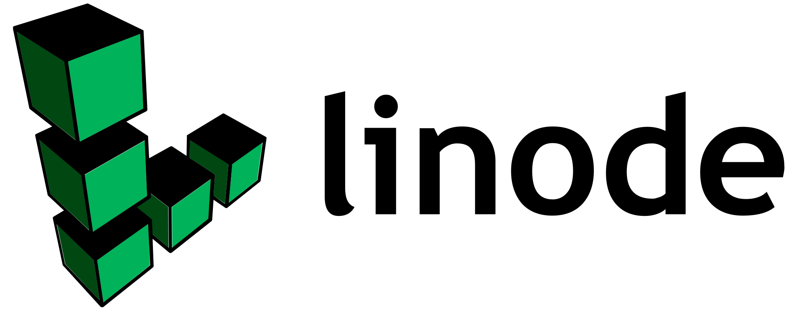
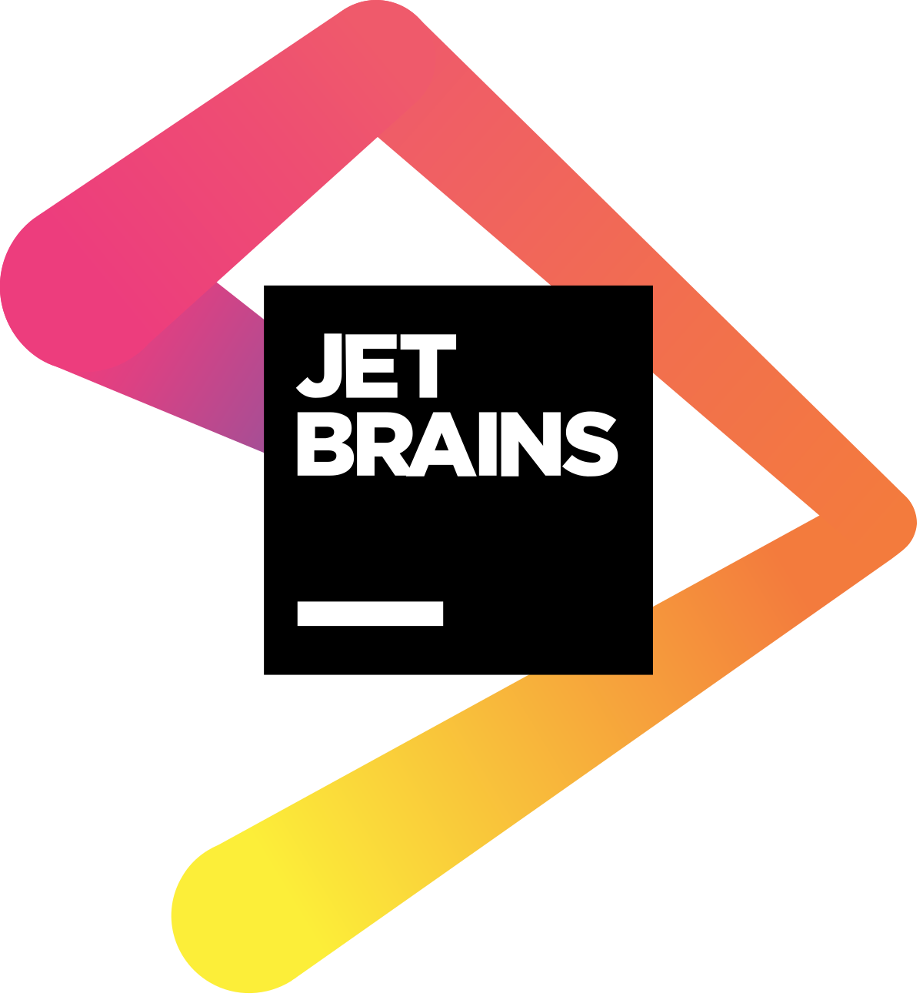

[![Contributors][contributors-shield]][contributors-url]
[![Forks][forks-shield]][forks-url]
[![Stargazers][stars-shield]][stars-url]
[![Issues][issues-shield]][issues-url]
[![MIT License][license-shield]][license-url]
[![Docker Pulls][docker-pull]][docker-pull]

<!-- PROJECT LOGO -->
 

  <a href="https://github.com/hay-kot/mealie">
<svg style="width:100px;height:100px" viewBox="0 0 24 24">
    <path fill="currentColor" d="M8.1,13.34L3.91,9.16C2.35,7.59 2.35,5.06 3.91,3.5L10.93,10.5L8.1,13.34M13.41,13L20.29,19.88L18.88,21.29L12,14.41L5.12,21.29L3.71,19.88L13.36,10.22L13.16,10C12.38,9.23 12.38,7.97 13.16,7.19L17.5,2.82L18.43,3.74L15.19,7L16.15,7.94L19.39,4.69L20.31,5.61L17.06,8.85L18,9.81L21.26,6.56L22.18,7.5L17.81,11.84C17.03,12.62 15.77,12.62 15,11.84L14.78,11.64L13.41,13Z" />
</svg>
  </a>

  <h3 align="center">Mealie</h3>

  

    A Place for All Your Recipes
     
    <a href="https://hay-kot.github.io/mealie/"><strong>Explore the docs »</strong></a>
  
     
    <a href="https://mealie-demo.hay-kot.dev/">View Demo</a>
    ·
    <a href="https://github.com/hay-kot/mealie/issues">Report Bug</a>
    ·
    <a href="https://hay-kot.github.io/mealie/api/redoc/">API</a>
    ·
    <a href="https://github.com/hay-kot/mealie/issues">
    Request Feature
    </a>
    ·
    <a href="https://hub.docker.com/r/hkotel/mealie"> Docker Hub
    </a>

[![Product Name Screen Shot][product-screenshot]](https://docs.mealie.io)

# About The Project

Mealie is a self hosted recipe manager and meal planner with a RestAPI backend and a reactive frontend application built in Vue for a pleasant user experience for the whole family. Easily add recipes into your database by providing the url and Mealie will automatically import the relevant data or add a family recipe with the UI editor. Mealie also provides an API for interactions from 3rd party applications.

- [Remember to join the Discord](https://discord.gg/QuStdQGSGK)!
- [Documentation](https://docs.mealie.io)

<!-- CONTRIBUTING -->
## Contributing

Contributions are what make the open source community such an amazing place to be learn, inspire, and create. Any contributions you make are **greatly appreciated**. If you're going to be working on the code-base you'll want to use the nightly documentation to ensure you get the latest information.

- See the [Contributors Guide](https://nightly.mealie.io/contributors/developers-guide/code-contributions/) for help getting started.
- We use VSCode Dev Contains to make it easy for contributors to get started!

If you are not a coder, you can still contribute financially. financial contributions help me prioritize working on this project over others and helps me know that there is a real demand for project development.

<!-- LICENSE -->
## License
Distributed under the MIT License. See `LICENSE` for more information.

## Sponsors

Huge thanks to all the sponsors of this project on [Github Sponsors](https://github.com/sponsors/hay-kot) and Buy Me a Coffee. Without you this project would surely not be possible.

Thanks to Linode for providing Hosting for the Demo, Beta, and Documentation sites! Another big thanks to JetBrains for providing their IDEs for development.

  
  

<!-- MARKDOWN LINKS & IMAGES -->
<!-- https://www.markdownguide.org/basic-syntax/#reference-style-links -->
[contributors-shield]: https://img.shields.io/github/contributors/hay-kot/mealie.svg?style=flat-square
[docker-pull]: https://img.shields.io/docker/pulls/hkotel/mealie
[contributors-url]: https://github.com/hay-kot/mealie/graphs/contributors
[forks-shield]: https://img.shields.io/github/forks/hay-kot/mealie.svg?style=flat-square
[forks-url]: https://github.com/hay-kot/mealie/network/members
[stars-shield]: https://img.shields.io/github/stars/hay-kot/mealie.svg?style=flat-square
[stars-url]: https://github.com/hay-kot/mealie/stargazers
[issues-shield]: https://img.shields.io/github/issues/hay-kot/mealie.svg?style=flat-square
[issues-url]: https://github.com/hay-kot/mealie/issues
[license-shield]: https://img.shields.io/github/license/hay-kot/mealie.svg?style=flat-square
[license-url]: https://github.com/hay-kot/mealie/blob/master/LICENSE.txt
[linkedin-shield]: https://img.shields.io/badge/-LinkedIn-black.svg?style=flat-square&logo=linkedin&colorB=555
[linkedin-url]: https://linkedin.com/in/hay-kot
[product-screenshot]: docs/docs/assets/img/home_screenshot.png
