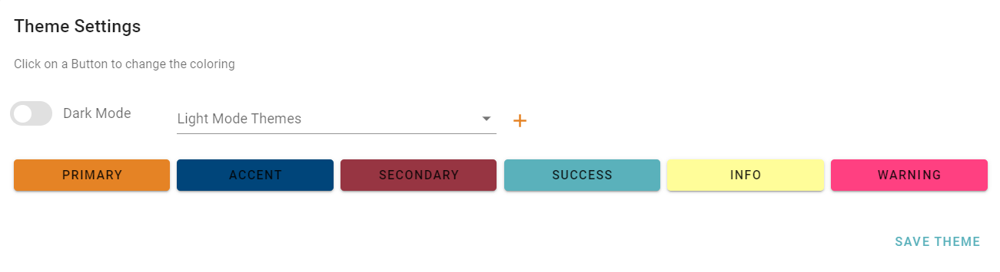
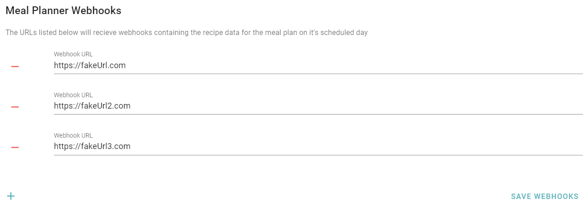

# Admin Panel
!!! danger
    As this is still a **BETA** It is reccomended that you backup your data often and store in more than one place. Adhear to backup best practies with the [3-2-1 Backup Rule](https://en.wikipedia.org/wiki/Backup)

### Theme Settings

## Backup and Export
All recipe data can be imported and exported as necessary from the UI. Under the admin page you'll find the section for using Backups and Exports. 

To create an export simple add the tag and the markdown template and click Backup Recipes and your backup will be created on the server. The backup is a standard zipfile containing all the images, json files, and rendered markdown files for each recipe. Markdown files are rendered from jinja2 templates. Adding your own markdown file into the templates folder will automatically show up as an option to select when creating a backup. 

To import a backup it must be in your backups folder. If it is in the backup folder it will automatically show up as an source to restore from. Selected the desired backup and import the backup file. 

## Meal Planner Webhooks
In the webhooks section you can find a list of all your endpoint URLs that are used as part of the meal planner 

## SFTP Settings - Target Release 1.0

## User Settings - Target Release 1.0