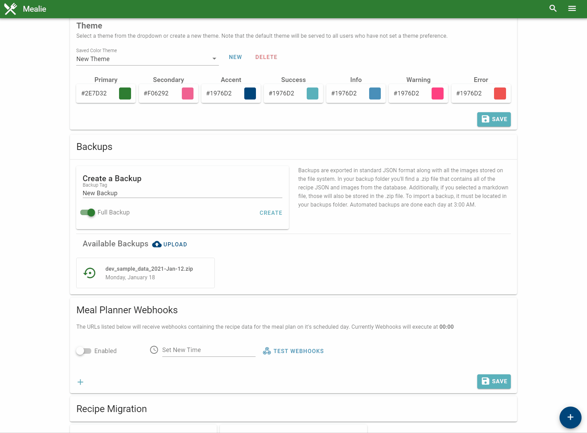

# Backup and Imports

All recipe data can be imported and exported as necessary from the UI. Under the admin page you'll find the section for using Backups and Exports. 

!!! danger
    As this is still a **BETA** It is recommended that you backup your data often and store in more than one place. Ad-hear to backup best practices with the [3-2-1 Backup Rule](https://en.wikipedia.org/wiki/Backup). Prior to upgrading you **should** perform a backup to limit any data loss.

!!! tip "Mealie data that is saved on backups"
    - [x] Recipe Data
    - [ ] Meal Plan
    - [x] Site Settings
    - [x] Custom Pages
    - [x] User Data
    - [x] Group Data

To create an export simply add the tag and the markdown template and click "Create" and your backup will be created on the server. The backup is a standard zipfile containing all the images, json files, and rendered jinaj2 templates for each recipe. To view the available variables, open a recipe in the json editor.

To import a backup it must be in your backups folder. If it is in the backup folder it will automatically show up as a source to restore from. Selected the desired backup and import the backup file. Backups can be uploaded from the UI as well as added on the file system

## Demo



## API Examples
You can use the API to create and retrieve backups remotely from any server that can access the Mealie instance. This is useful for easily managing off-site backups via cron-job or other scheduled tasks. You can find interactive documentation for your API at https://your-mealie-instance.com/docs

### curl Example
Create a backup with curl
```bash
curl -X 'POST' \
  'http://localhost:9000/api/backups/export/database' \
  -H 'accept: application/json' \
  -H 'Content-Type: application/json' \
  -d '{
  "tag": "July 23rd 2021",
  "options": {
    "recipes": true,
    "settings": true,
    "themes": true
  },
  "templates": [
    "recipes.md"
  ]
}'
```

### wget Example
First request a file token with curl:
```bash
curl -X 'GET' \
  'http://localhost:9000/api/backups/{file_name}/download' \
  -H 'accept: application/json' \
  -H 'Content-Type: application/json'
```

Then download the file with wget:
```bash
wget http://localhost:9000/api/utils/download?token={fileToken}
```


## Jinja2 Templating
On export you can select a template to use to render files using the jinja2 syntax. This can be done to export recipes in other formats besides regular .json.Look at this example for rendering a markdown recipe using the jinja2 syntax. 

### Input
```jinja2


# {{ recipe.name }}
{{ recipe.description }}

## Ingredients

- [ ] {{ ingredient }}


## Instructions

- [ ] {{ step.text }}



**{{ note.title }}:** {{ note.text }}


---

Tags: {{ recipe.tags }}
Categories: {{ recipe.categories }}
Original URL: {{ recipe.orgURL }}
```

### Output
```markdown


# Five Spice Popcorn Chicken
It’s easy to rely on take-out for some of our favorite Chinese dishes. However, with the right pantry staples, dishes like this Five Spice Popcorn Chicken can become part of your go-to arsenal of recipes. This crispy chicken is coated in a creamy, tangy sauce, made zesty with The Spice Hunter Chinese Five Spice, a blend of star anise, cloves, cinnamon, fennel, and black pepper.

## Ingredients
- [ ] 1 tablespoon soy sauce
- [ ] 1 tablespoon sugar
- [ ] 1 teaspoon The Spice Hunter® Chinese Five Spice Blend, plus more for serving
- [ ] 1 clove garlic, finely grated
- [ ] 1 1/2 pounds boneless skinless chicken thighs, cut into roughly 1-inch chunks
- [ ] ⅓ cup cornstarch
- [ ] 1 large egg, beaten
- [ ] ¾ cup all-purpose flour
- [ ] Canola or vegetable oil, for frying
- [ ] Flaky sea salt
- [ ] Scallion, thinly sliced, for serving
- [ ] Sriracha mayonnaise, for serving, optional


## Instructions
- [ ] In a medium bowl, whisk the soy sauce with the sugar, Chinese Five Spice, and garlic. Add the chicken and toss to coat. Let marinate 15 minutes.
- [ ] Drain any excess marinade off of the chicken and toss the chicken with the cornstarch to coat. Once fully coated, add the beaten egg and toss to coat.
- [ ] In a large heavy bottomed pot, heat 1-inch of oil to 350.
- [ ] Place the flour in a large ziploc bag. Working in batches, transfer a few chicken pieces into the bag with the flour and toss to coat, then remove, leaving excess flour in the bag.
- [ ] Carefully place the breaded chicken in the hot oil and fry, turning occasionally, until golden and cooked through about 3 to 4 minutes.
- [ ] Using a slotted spoon or spider, transfer the cooked chicken to a paper towel lined plate. Season with salt and additional Chinese Five Spice seasoning. Repeat the flouring and frying with remaining chicken.
- [ ] Serve with scallions, more Chinese Five Spice Blend, and optional sriracha mayonnaise.

---

Tags: []
Categories: []
Original URL: https://www.bonappetit.com/recipe/five-spice-popcorn-chicken#intcid=_bon-appetit-recipe-bottom-recirc_3cad5ce9-734a-46f8-b503-78c33d2e7279_similar2-3
```

If you decide you don't like mealie. This is a good way to export into a format that can be imported into another. 