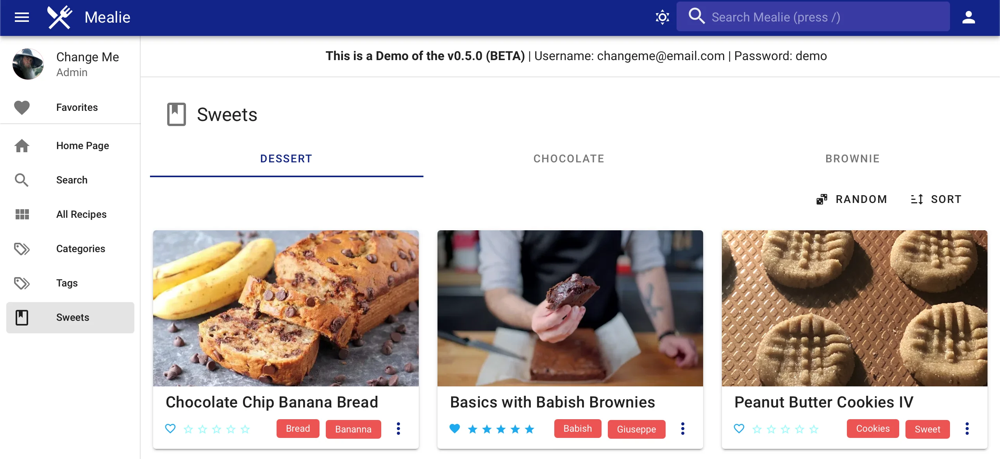
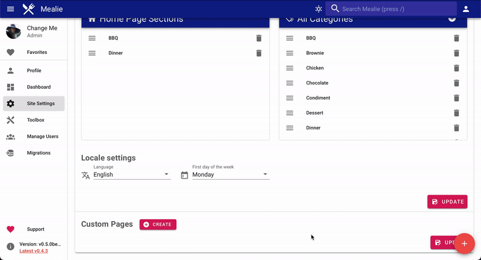

# Building Pages

!!! warning
    The page building is still experimental and may change. You can provide feedback on any changes you'd like to see on [github](https://github.com/hay-kot/mealie/discussions/229){:target="_blank"}

Custom pages can be created to organize multiple categories into a single page. Links to your custom pages are displayed on the home page sidebar and accessible by all users, however only Administrators can create or update pages.

To create a new page. Navigate to the settings page at `/admin/settings` and scroll down to the custom pages section. Here you can create, view, and edit your custom pages. To reorder how they are displayed on the sidebar you can drag and drop the pages into the preferred order.

!!! tip
    To save the order of pages you must click the save button displayed on the bottom of the Custom Page section. This is not necessary for updating individual page data. 