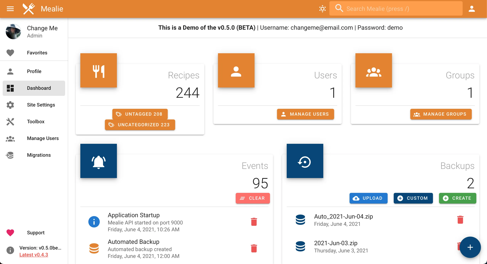

#Dashboard

The dashboard gives you a quick overview of how your Mealie is doing. There is a 'Recipes' card, an overview of the users and groups, an 'Events' card and a 'Backups' card.

## Recipes
'Recipes' shows how many recipes you have in your catalogue but also checks if you have any untagged or uncategorized ones. If you click on one of these, you are redirected to the Toolbox where you can further organize these recipes.

## Users
This gives an overview of the total number of users for your Mealie instance. The 'manage users' and 'manage groups' button will redirect you to the [user-management page](../admin/dashboard.md)

## Backups
Here you can choose to import an older backup from a previous instance. You could also create a custom backup with your own tag where you can choose for a full backup or only some parts like recipes, users,...
If you click 'create', an automatic backup is generated.
