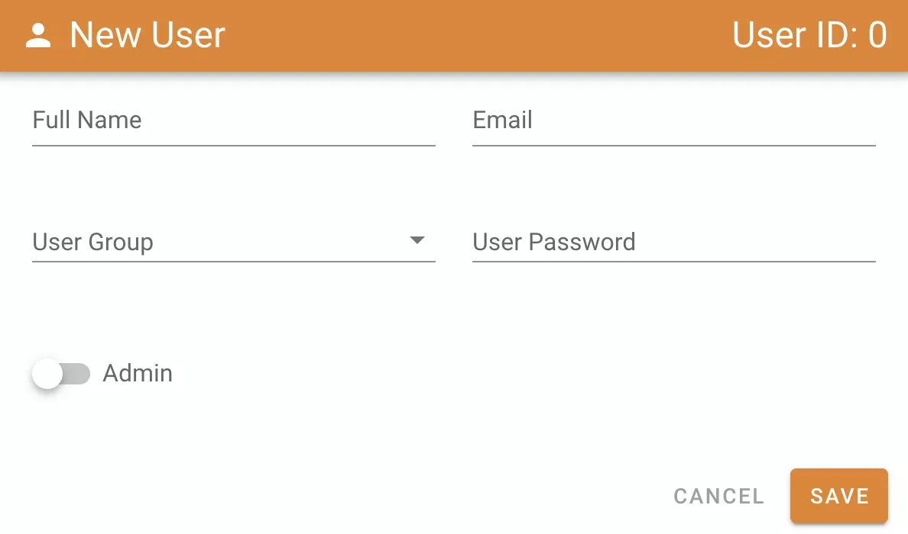
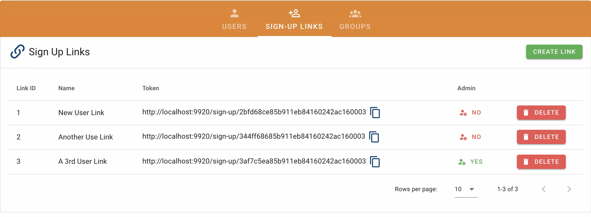
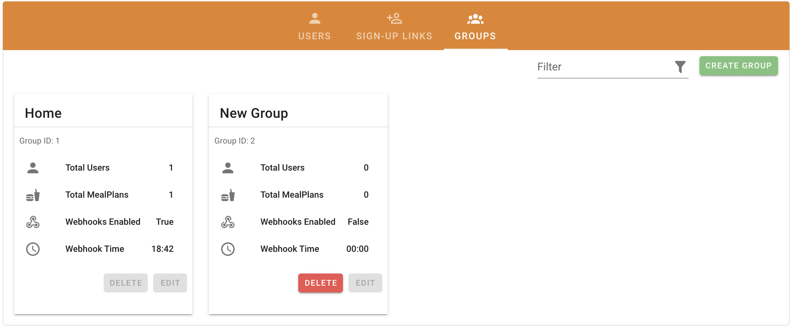

# User Management

As of version v0.4.0 users have limited functionality, but they will offer more permissions and structure as time goes on. To understand the different systems, see each section below. Note, that by default all users will be assigned the default group. If you're only managing one household you won't need to do anything to set up a new group.

!!! summary "Users and Groups"
    === ":fontawesome-solid-user-cog: Admins"

        Mealie admins are super users that have access to all user data (excluding passwords). All admins can perform administrative tasks like adding users, resetting user passwords, backing up the database, migrating data, and managing site settings. 

        **Admins Can**
        
        - All User Actions
        - Adjust Site Settings
        - Create and Update Users
        - Create and Update Groups
        - Generate User Sign-up Links
        - Migrate Data from other Services
        - Backup Site Data

    === ":fontawesome-solid-user: Users"

        A single user created by an Admin that has basic privileges to edit their profile, create and edit recipes.

        **Users Can**

        - Manage Their Profile
        - Create, Edit, and Update Recipes
        - Create, Edit, and Update Mealplans *(By Group)*
        - Set Mealplan Categories
        - Create and Schedule Webhooks *(By Group)*

    === ":fontawesome-solid-users: Groups"

        User groups are a collection of users that are associated together. Typically used for separate households sharing a single instance.
        
        **Groups Share**

        - Mealplans
        - Mealplan Settings
        - Webhooks 

!!! warning
    As of v0.4.0 any authenticated user is able to perform any action on the backend server through the API. To limit a standard users scope, the pages on the frontend are limited. Proper support for permission structures on the backend API will come in a later version. 

## Startup
On the first startup you'll need to login to Mealie using the default username and password `changeme@email.com` and `MyPassword` or the default set through the env variable. On first login you'll be required to reset your password. After resetting your password you should also change your email address as appropriate. This will be used for logins on all future requests. 

!!! tip 
    Your default password environment variable will be the default password for all new users that are created. This is stored in plain text and should not be used **anywhere** else.
    

## Creating and Editing Users
There are two ways to create users in Mealie. 

### Manually Creating a User
In the Manage Users section you are able to create a user by providing the necessary information in the pop-up dialog. 

{: align=right style="height:50%;width:50%"}

- User Name
- Email
- User Group
- If they are an Admin

When creating users manually, their password will be set from the default assigned by the ENV variable.

### Sign Up Links
You can generate sign-up links in the Manage Users section. Select the "create link" button and provide the name of the link and if the user will be an administrator. Once a link is created it will populate in the table where you'll be able to see all active links, delete a link, and copy the link as needed. 

!!! tip 
    When a link is used it is automatically removed from the database.

## Creating Groups
You can easily create and manage groups via the frontend in the admin panel under "Manage Users". Navigate to the groups tab and you'll find a "create group" button as well as a list of all groups in your database. To create a group, select the "create group" button and provide a name for the new group. Once created you can now assign users to the new group.

!!! tip
    User Groups can only be deleted if no users are a part of the group. If you want to delete a group, you must assign the users to another group before removing. 

## Password Reset
If a user forgets their password an administrator is able to reset their password through the user management page. In the user table, select edit. In the popup window click the "Reset Password" to reset a user's password to the default. This is either 'MyPassword' or set through an environment variable. See the [Installation Page](../getting-started/install.md) for more details on environment variables.
