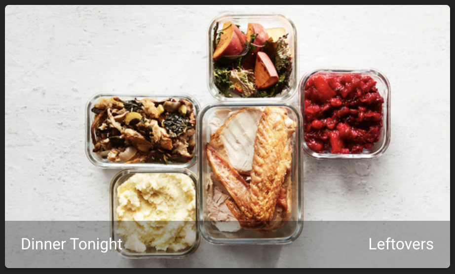

!!! info
	This guide was submitted by a community member. Find something wrong? Submit a PR to get it fixed!


In a lot of ways, Home Assistant is why this project exists! Since it Mealie has a robust API it makes it a great fit for interacting with Home Assistant and pulling information into your dashboard.

### Get Todays Meal in Lovelace
Starting in v0.4.1 you are now able to use the uri `/api​/meal-plans​/today​/image?group_name=Home` to directly access the image to todays meal. This makes it incredible easy to include the image into your Home Assistant Dashboard using the picture entity. 

Here's an example where `sensor.mealie_todays_meal` is pulling in the meal-plan name and I'm using the url to get the image.



```yaml
type: picture-entity
entity: sensor.mealie_todays_meal
name: Dinner Tonight
show_state: true
show_name: true
image: 'http://localhost:9000/api/meal-plans/today/image?group_name=Home'
style:
.: |
    ha-card {
    max-height: 300px !important;
    overflow: hidden;
    display: flex;
    align-items: center;
    justify-content: center;
    }
```


!!! tip
    Due to how Home Assistant works with images, I had to include the additional styling to get the images to not appear distorted. This includes and [additional installation](https://github.com/thomasloven/lovelace-card-mod){:target="_blank"} from HACS. 
