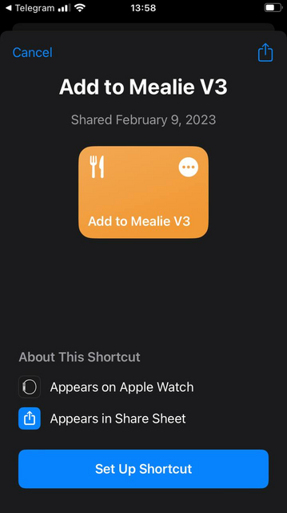
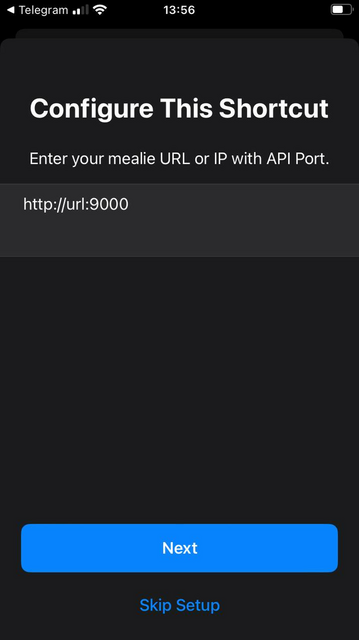
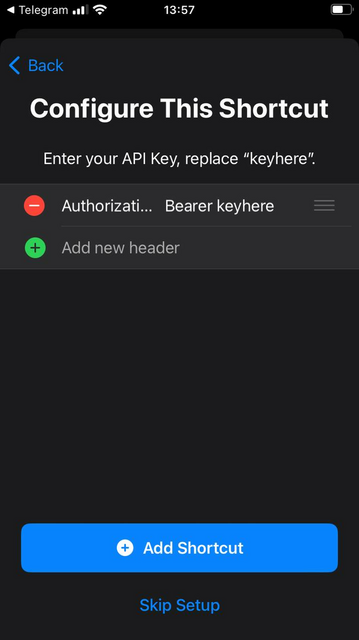

# Using iOS Shortcuts with Mealie

!!! info
    This guide was submitted by a community member. Find something wrong? Submit a PR to get it fixed!

User [brasilikum](https://github.com/brasilikum) opened an issue on the main repo about how they had created an [iOS shortcut](https://github.com/hay-kot/mealie/issues/103) for interested users.
This original method broke after the transition to version 1.X and an issue was raised on [Github](https://github.com/hay-kot/mealie/issues/2092) GitHub user [Zippyy](https://github.com/zippyy) has helped to create a working shortcut for version 1.X.

This is a useful utility for iOS users who browse for recipes in their web browser from their devices.

Don't know what an iOS shortcut is? Neither did I! Experienced iOS users may already be familiar with this utility but for the uninitiated, here is the official Apple explanation:

> A shortcut is a quick way to get one or more tasks done with your apps. The Shortcuts app lets you create your own shortcuts with multiple steps. For example, build a “Surf Time” shortcut that grabs the surf report, gives an ETA to the beach, and launches your surf music playlist.

Basically it is a visual scripting language that lets a user build an automation in a guided fashion. The automation can be [shared with anyone](https://www.icloud.com/shortcuts/cc568d1615bc4f998789f85d1ef74846) but if it is a user creation, you'll have to jump through a few hoops to make an untrusted automation work on your device.

This guide assumes that you already know how to [generate API tokens](https://hay-kot.github.io/mealie/documentation/users-groups/user-settings/#api-key-generation) for your user that intends to use an iOS shortcut.

First, click the [link](https://www.icloud.com/shortcuts/cc568d1615bc4f998789f85d1ef74846) and begin the setup of the shortcut.

Next, you need to replace `url` and `port` with the information for your mealie instance.

If you have a TLD that you use, put that here with no port. If you just run local, Then, you need to put in your mealie instance IP and the port of `9926`.

Finally, you need to replace the word `keyhere` with your API token. Keep the word `Bearer`!!!

You should now be able to share a website to the shortcut and have mealie grab all the necessary information!
