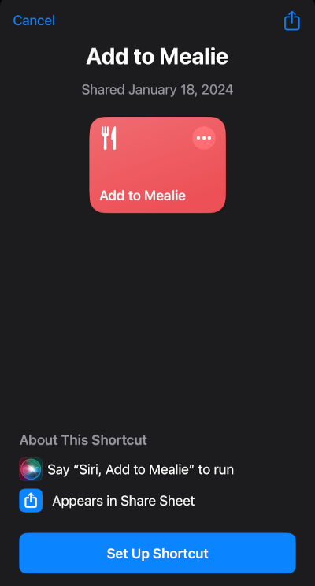
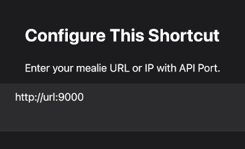
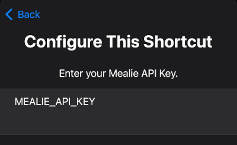
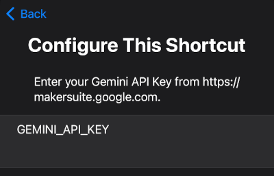

# Using iOS Shortcuts with Mealie

!!! info
    This guide was submitted by a community member. Find something wrong? Submit a PR to get it fixed!

Don't know what an iOS shortcut is? Neither did I! Experienced iOS users may already be familiar with this utility but for the uninitiated, here is the official Apple explanation:

> A shortcut is a quick way to get one or more tasks done with your apps. The Shortcuts app lets you create your own shortcuts with multiple steps. For example, build a “Surf Time” shortcut that grabs the surf report, gives an ETA to the beach, and launches your surf music playlist.

Basically it is a visual scripting language that lets a user build an automation in a guided fashion. The automation can be [shared with anyone](https://www.icloud.com/shortcuts/94aa272af5ff4d2c8fe5e13a946f89a9) but if it is a user creation, you'll have to jump through a few hoops to make an untrusted automation work on your device.

## Setup Video

The following YouTube video walks through setting up the shortcut in 3 minutes for those who prefer following along visually.

<iframe width="560" height="315" src="https://www.youtube.com/embed/XZk6S1MVUrE?si=HGH07RbK-Ip_1qFz" title="YouTube video player" frameborder="0" allow="accelerometer; autoplay; clipboard-write; encrypted-media; gyroscope; picture-in-picture; web-share" allowfullscreen></iframe>

## Guide

### Prerequisites

Before setting up the shortcut, make sure you have the following information ready and easily accessable on your Apple device.

1. The URL of your Mealie instance
2. An API Key for your user
3. A Gemini API Key from [Google AI Studio](https://makersuite.google.com)

!!! note
    A Gemini API Key is not required for importing URLs from Safari or your Camera, however you will not be able to take a photo of a recipe and import it without a Gemini key.

    Google AI Studio is currently only available in [certain countries and languages](https://ai.google.dev/available_regions). Most notably it is not currently available in Europe.

### Setup

On the Apple device you wish to add the shortcut to, click on [this link](https://www.icloud.com/shortcuts/94aa272af5ff4d2c8fe5e13a946f89a9) to begin the setup of the shortcut.

Next, you need to replace `url` and `port` with the information for your Mealie instance.

If you have a domain that you use (e.g. `https://mealie.example.com`), put that here. If you just run local, then you need to put in your Mealie instance IP and the port you use (e.g. the default is `9925`).

Next, you need to replace `MEALIE_API_KEY` with your API token.

Finally, replace `GEMINI_API_KEY` with the one you got from [Google AI Studio](https://makersuite.google.com)

You may wish to [add the shortcut to your home screen](https://support.apple.com/guide/shortcuts/add-a-shortcut-to-the-home-screen-apd735880972/ios) for easier access.

## Features

- Share a website from Safari with Mealie to import via URL.
- Share a recipe photo from photos to perform OCR and import a physical recipe.
- Trigger the shortcut and take a photo of a physical recipe to import.
- Trigger the shortcut to select a photo from your Photos app to import.
- Trigger the shortcut to take a picture of a URL (like on the bottom of a printed recipe) to import.

## Troubleshooting

Sometimes Gemini will not be able to parse a recipe, and you will get an error. Users have found success with a combination of the following:

1. #### Try Again
   Sometimes Gemini returns the wrong information which causes the import to fail. Often, trying again will be successful.

2. #### Photo Quality
   Make sure there is no large glare or shadow over the picture, and you have all the text in frame.

3. #### Edit the Photo
   Users have found success by cropping the picture to just the recipe card, adding a "mono" filter, and cranking up the exposure before importing.

## History

User [brasilikum](https://github.com/brasilikum) opened an issue on the main repo about how they had created an [iOS shortcut](https://github.com/mealie-recipes/mealie/issues/103) for interested users.

This original method broke after the transition to version 1.X and an issue was raised on [Github](https://github.com/mealie-recipes/mealie/issues/2092) GitHub user [Zippyy](https://github.com/zippyy) has helped to create a working shortcut for version 1.X.

When OCR was removed from Mealie, GitHub user [hunterjm](https://github.com/zippyy) created a new shortcut that uses Apple's built-in OCR and Google Gemini to enhance and replace that functionality.
