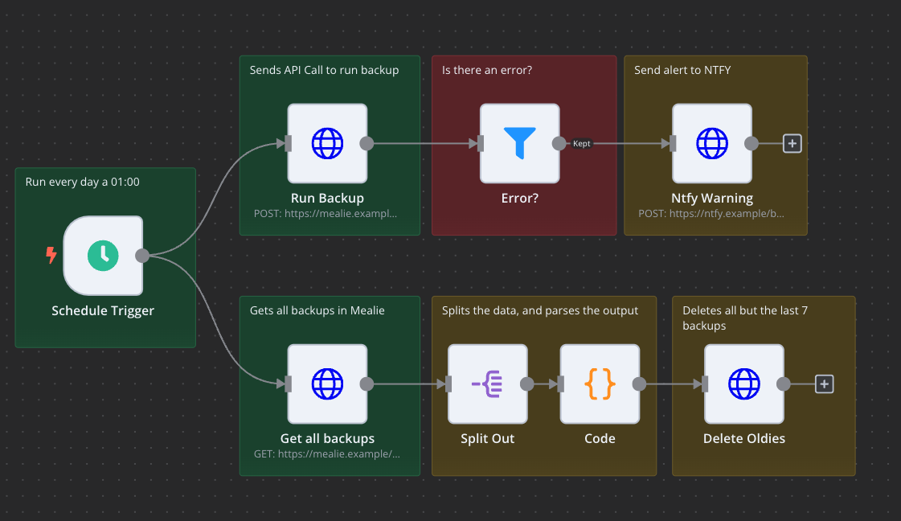
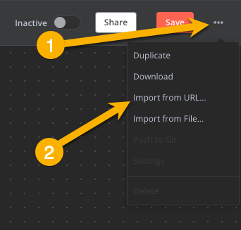

# Automating Backups with n8n

!!! info
This guide was submitted by a community member. Find something wrong? Submit a PR to get it fixed!

> [n8n](https://github.com/n8n-io/n8n) is a free and source-available fair-code licensed workflow automation tool. Alternative to Zapier or Make, allowing you to use a UI to create automated workflows.

This example workflow:

1. Backups Mealie every morning via an API call
2. Deletes all but the last 7 backups

> [!CAUTION]
> This only automates the backup function, this does not backup your data to anywhere except your local instance. Please make sure you are backing up your data to an external source.

---

# Setup

## Deploying n8n

Follow the relevant guide in the [n8n Documentation](https://docs.n8n.io/)

## Importing n8n workflow

1. In n8n, add a new workflow
2. In the top right hit the 3 dot menu and select 'Import from URL...'

3. Paste `https://github.com/mealie-recipes/mealie/blob/mealie-next/docs/docs/assets/other/n8n/n8n-mealie-backup.json` and click Import
4. Click through the nodes and update the URLs for your environment

## API Credentials

#### Generate Mealie API Token

1. Head to https://mealie.example.com/user/profile/api-tokens
   > If you dont see this screen make sure that "Show advanced features" is checked under https://mealie.example.com/user/profile/edit
2. Under token name, enter the name of the token i.e. 'n8n' and hit Generate
3. Copy and keep this API Token somewhere safe, this is like your password!

> You can use your normal user for this, but assuming you're an admin you could also choose to create a user named n8n and generate the API key against that user.

#### Setup Credentials in n8n

> [n8n Docs](https://docs.n8n.io/credentials/add-edit-credentials/)

1. Create a new "Header Auth" Credential

2. In the connection screen set - Name as `Authorization` - Value as `Bearer {INSERT MEALIE API KEY}`

3. In the workflow you created, for the "Run Backup", "Get All backups", and "Delete Oldies" nodes, update:
   - Authentication to `Generic Credential Type`
   - Generic Auth Type to `Header Auth`
   - Header Auth to `Mealie API` or whatever you named your credentials

## Notification Node

> Please use error notifications of some kind. It's very easy to set and forget an automation, then have the worst happen and lose data.

[ntfy](https://github.com/binwiederhier/ntfy) is a great open source, self-hostable tool for sending notifications.

If you want to use ntfy, you will need to install it on your environment, or sign up for their service, and configure it with the webhook URL.

If you want to use another notification service, you can create a new node in n8n that sends the notification using whatever method you like.

- For example, if you want to send a push notification via [Pushover](https:/pushover.net/) you could create a new node that uses the Pushover API and sends the notification.
- You can use the [Send Email](https://docs.n8n.io/integrations/builtincore-nodes/n8n-nodes-base.sendemail/) node in n8n as an example of how to create your own custom node.
- You can send it off to InfluxDB, Slack, Discord etc. Go nuts.

If you're using another method for backups we'd love to hear about it. Pop in [Discord](https://discord.gg/QuStdQGSGK) and say hi!
