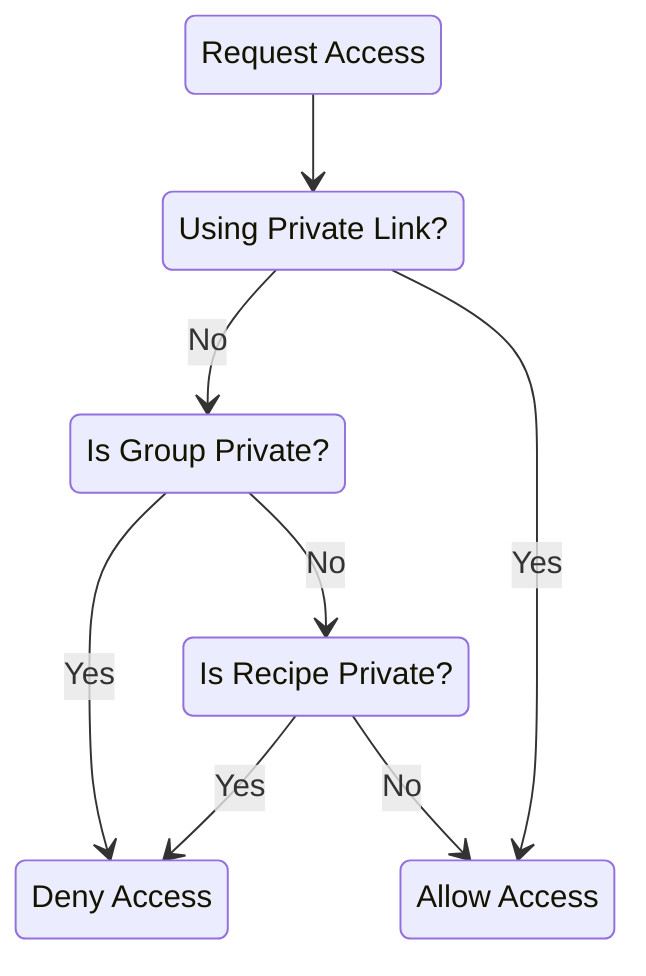

# Frequently Asked Questions

## How do I enable "smart" ingredient handling?

You might have noticed that scaling up a recipe or making a shopping list doesn't by default handle the ingredients in a way you might expect. Depending on your settings, scaling up might yield things like `2 1 cup broth` instead of `2 cup broth`. And, making shopping lists from recipes that have shared ingredients can yield multiple lines of the same ingredient. **But**, Mealie has a mechanism to intelligently handle ingredients and make your day better. How?
### Set up your Foods and Units
Do the following just **once**. Doing this applies to your whole group, so be careful.

1. Click on your name in the upper left corner to get to your settings
2. In the bottom right, select `Manage Data`
3. In the Management page, make sure that a little orange button says `Foods`
4. If your Foods database is empty, click `Seed` and choose your language. You should end up with a list of foods. (Wait a bit for seeding to happen, and try not to seed more than once or you will have duplicates)
5. Click the little orange `Foods` button and now choose `Units`.
6. Click `Seed` and choose your language. You should end up with a list of units (e.g. `tablespoon`)

Initial seeding of Units is pretty complete, but there are many Foods in the world. You'll probably find that you need to add Foods to the database during parsing for the first several recipes. Once you have a well-populated Food database, there are API routes to parse ingredients automatically in bulk. But this is not a good idea without a very complete set of Foods.

### Set up Recipes to use Foods and Units
Do the following for each recipe you want to intelligently handle ingredients.

1. Go to a recipe
2. Click the Edit button/icon
3. Click the Recipe Settings gear and deselect `Disable Ingredient Amounts`
4. Save
5. The ingredients should now look a little weird (`1 1 cup broth` and so on)
6. Click the Edit button/icon again
7. Scroll to the ingredients and you should see new fields for Amount, Unit, Food, and Note. The Note in particular will contain the original text of the Recipe.
8. Click `Parse` and you will be taken to the ingredient parsing page.
9. Choose your parser. The `Natural Language Parser` works very well, but you can also use the `Brute Parser`, or the `OpenAI Parser` if you've [enabled OpenAI support](./installation/backend-config.md#openai).
10. Click `Parse All`, and your ingredients should be separated out into Units and Foods based on your seeding in Step 1 above.
11. For ingredients where the Unit or Food was not found, you can click a button to accept an automatically suggested Food to add to the database. Or, manually enter the Unit/Food and hit `Enter` (or click `Create`) to add it to the database
12. When done, click `Save All` and you will be taken back to the recipe. Now the Unit and Food fields of the recipe should be filled out.

Scaling up this recipe or adding it to a Shopping List will now smartly take care of ingredient amounts and duplicate combinations.

## Is it safe to upgrade Mealie?

Yes. If you are using the v1 branches (including beta), you can upgrade to the latest version of Mealie without performing a site Export/Restore. This process was required in previous versions of Mealie, however we've automated the database migration process to make it easier to upgrade. Note that if you were using the v0.5.x version, you CANNOT upgrade to the latest version automatically. You must follow the migration instructions in the documentation.

- [Migration From v0.5.x](./migrating-to-mealie-v1.md)

## How can I change the theme?

You can change the theme by settings the environment variables.

- [Backend Config - Themeing](./installation/backend-config.md#themeing)

## How can I change the login session timeout?

Login session can be configured by setting the `TOKEN_TIME` variable on the backend container.

- [Backend Config](./installation/backend-config.md)

## Can I serve Mealie on a subpath?

No. Due to limitations from the JavaScript Framework, Mealie doesn't support serving Mealie on a subpath.

## Can I install Mealie without docker?

Yes, you can install Mealie on your local machine. HOWEVER, it is recommended that you don't. Managing non-system versions of python, node, and npm is a pain. Moreover, updating and upgrading your system with this configuration is unsupported and will likely require manual interventions.

## What is fuzzy search and how do I use it?
Mealie can use fuzzy search, which is robust to minor typos. For example, searching for "brocolli" will still find your recipe for "broccoli soup". But fuzzy search is only functional on a Postgres database backend. To enable fuzzy search you will need to migrate to Postgres:

1. Backup your database and download the .zip file (same as when [migrating](./migrating-to-mealie-v1.md))
2. Set up a [Postgres](./installation/postgres.md) instance of Mealie
3. Upload the backup .zip and click to apply it (as as migration)

## How can I attach an image or video to a Recipe?

Mealie's Recipe Steps and other fields support markdown syntax and therefore support images and videos. To attach an image to the recipe, you can upload it as an asset and use the provided copy button to generate the html image tag required to render the image. For videos, Mealie provides no way to host videos. You'll need to host your videos with another provider and embed them in your recipe. Generally, the video provider will provide a link to the video and the html tag required to render the video. For example, YouTube provides the following link that works inside a step. You can adjust the width and height attributes as necessary to ensure a fit.

```html
<iframe width="560" height="315" src="https://www.youtube.com/embed/nAUwKeO93bY" title="YouTube video player" frameborder="0" allow="accelerometer; autoplay; clipboard-write; encrypted-media; gyroscope; picture-in-picture" allowfullscreen></iframe>
```

## How can I unlock my account?

If your account has been locked by bad password attempts, you can use an administrator account to unlock another account. Alternatively, you can unlock all accounts via a script within the container.

```shell
docker exec -it mealie-next bash

python /app/mealie/scripts/reset_locked_users.py
```

## How can I change my password?

You can change your password by going to the user profile page and clicking the "Change Password" button. Alternatively you can use the following script to change your password via the CLI if you are locked out of your account.

```shell
docker exec -it mealie-next bash

python /app/mealie/scripts/change_password.py
```

## I can't log in with external auth. How can I change my authentication method?

Follow the [steps above](#how-can-i-change-my-password) for changing your password. You will be prompted if you would like to switch your authentication method back to local auth so you can log in again.

## How do private groups and recipes work?

Managing private groups and recipes can be confusing. The following diagram and notes should help explain how they work to determine if a recipe can be shared publicly.

- Private links that are generated from the recipe page using the `Share` button bypass all group and recipe permissions
- Private groups block all access to recipes, including those that are public, except as noted above.
- Groups with "Allow users outside of your group to see your recipes" disabled block all access to recipes, except as noted above.
- Private recipes block all access to the recipe from public links. This does not affect Private Links.



For more information, check out the [Permissions and Public Access guide](./usage/permissions-and-public-access.md).

## Can I use fail2ban with Mealie?
Yes, Mealie is configured to properly forward external IP addresses into the `mealie.log` logfile. Note that due to restrictions in docker, IP address forwarding only works on Linux.

Your fail2ban usage should look like the following:
```
Use      datepattern : %d-%b-%y %H:%M:%S : Day-MON-Year2 24hour:Minute:Second
Use   failregex line : ^ERROR:\s+Incorrect username or password from <HOST>
```

## Why an API?
An API allows integration into applications like [Home Assistant](https://www.home-assistant.io/) that can act as notification engines to provide custom notifications based on Meal Plan data to remind you to defrost the chicken, marinate the steak, or start the CrockPot. Additionally, you can access nearly any backend service via the API giving you total control to extend the application. To explore the API spin up your server and navigate to http://yourserver.com/docs for interactive API documentation.

## Why a database?
Some users of static-site generator applications like ChowDown have expressed concerns about their data being stuck in a database. Considering this is a new project, it is a valid concern to be worried about your data. Mealie specifically addresses this concern by providing automatic daily backups that export your data in json, plain-text markdown files, and/or custom Jinja2 templates. **This puts you in control of how your data is represented** when exported from Mealie, which means you can easily migrate to any other service provided Mealie doesn't work for you.

As to why we need a database?

- **Developer Experience:** Without a database, a lot of the work to maintain your data is taken on by the developer instead of a battle-tested platform for storing data.
- **Multi User Support:** With a solid database as backend storage for your data, Mealie can better support multi-user sites and avoid read/write access errors when multiple actions are taken at the same time.

## Why is there no "Keep Screen Alive" button when I access a recipe?
You've perhaps visited the Mealie Demo and noticed that it had a "Keep Screen Alive" button, but it doesn't show up in your own Mealie instance.
There are typically two possible reasons for this:
1. You're accessing your Mealie instance without using HTTPS. The Wake Lock API is only available if HTTPS is used. Read more here: https://developer.mozilla.org/en-US/docs/Web/API/Screen_Wake_Lock_API
2. You're accessing your Mealie instance on a browser which doesn't support the API. You can test this here: https://vueuse.org/core/useWakeLock/#demo

Solving the above points will most likely resolve your issues. However, if you're still having problems, you are welcome to create an issue. Just remember to add that you've tried the above two options first in your description.
