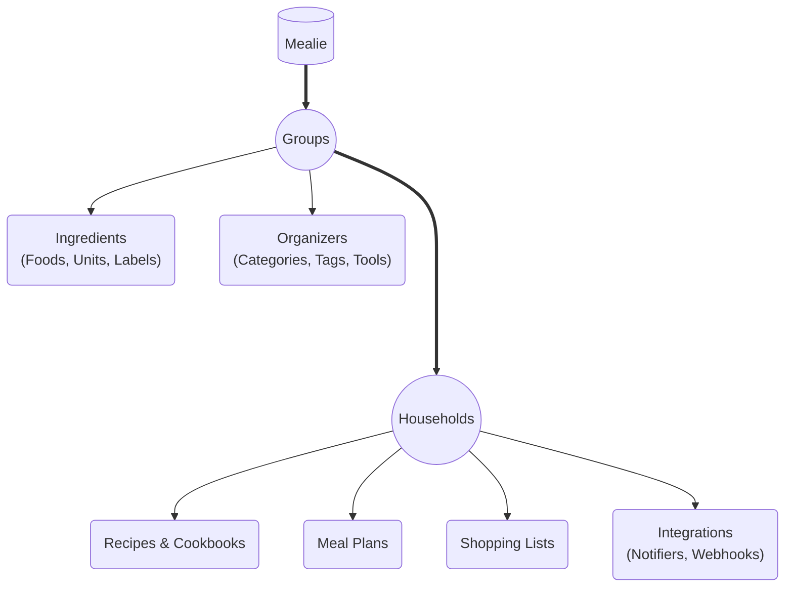

!!! info "Feature Set"
    This isn't an exhaustive list of features within Mealie, but it does capture the most important, overarching features that Mealie offers.


## Recipes

### Creating Recipes

Mealie offers two main ways to create recipes. You can use the integrated recipe-scraper to create recipes from hundreds of websites, or you can create recipes manually using the recipe editor.

[Creation Demo](https://demo.mealie.io/g/home/r/create/url){ .md-button .md-button--primary .align-right }

### Importing Recipes

Mealie supports importing recipes from a few other sources besides websites. Currently the following sources are supported:

- Tandoor
- Nextcloud Cookbooks
- Paprika
- Chowdown
- Plan to Eat
- Recipe Keeper
- Copy Me That
- My Recipe Box

You can access these options on your installation at the `/group/migrations` page on your installation. If you'd like to see another source added, feel free to request so on Github.


[Import Demo](https://demo.mealie.io/group/migrations){ .md-button .md-button--primary }


### Organizing Recipes

Mealie has a robust and flexible recipe organization system with a few different ways to organize your recipes in a way that fits your household.

#### Categories

Categories are the overarching organizer for recipes. You can assign as many categories as you'd like to a recipe, but we recommend that you try to limit the categories you assign to a recipe to one or two. This helps keep categories as focused as possible while still allowing you to find recipes that are related to each other. For example, you might assign a recipe to the category **Breakfast**, **Lunch**, **Dinner**, or **Side**.

[Categories Demo](https://demo.mealie.io/g/home/recipes/categories){ .md-button .md-button--primary }

#### Tags

Tags are nearly identical to categories in function but play a secondary role in some cases. As such, we recommend that you use tags freely to help you organize your recipes by more specific topics. For example, if a recipe can be frozen or is a great left-over meal, you could assign the tags **frozen** and **left-over** and easily filter for those at a later time.

[Tags Demo](https://demo.mealie.io/g/home/recipes/tags){ .md-button .md-button--primary }

#### Tools

Tools are another way that some users like to organize their recipes. If a recipe requires some specific equipment, it can be helpful to assign tools to the recipes. This is particularly useful for things that are less common, like a pressure cooker or a sous vide.

Each of the above organizers can be filtered in searches and have their own pages where you can view all the recipes that are associated with those organizers.

[Tools Demo](https://demo.mealie.io/g/home/recipes/tools){ .md-button .md-button--primary }

#### Cookbooks

Mealie also has the concept of cookbooks. These can be created inside of a group and can use a cross section of Categories, Tags, and Tools to filter recipes and view them in one specific page. Cookbooks are a great way to keep a subset of recipes easily accessible to you. You can think of them as a saved search results page. While most examples are simple, you can use as many organizers to filter a cookbook as you'd like.

#### Examples:

- Main Courses: This cookbooks has all the recipes that have the **Dinner** category
- Pasta Sides: Recipes that have both the **Side** category and the **Pasta** tag
- Dessert Breads: Recipes that have both the **Bread** category and the **Dessert** tag

[Cookbooks Demo](https://demo.mealie.io/g/home/cookbooks){ .md-button .md-button--primary }

## Meal Planning

Mealie uses a calendar like view to help you plan your meals. It shows you the previous day and the next 6 days by default. You can toggle through the calendar by clicking the arrows on the top of the page. In editor mode, you can use the random recipe buttons or manually add an entry.

!!! tip
    You can also add a "Note" type entry to your meal-plan when you want to include something that might not have a specific recipes. This is great for leftovers, or for ordering out.

[Mealplanner Demo](https://demo.mealie.io/household/mealplan/planner/view){ .md-button .md-button--primary }

### Planner Rules

The meal planner has the concept of plan rules. These offer a flexible way to use your organizers to customize how a random recipe is inserted into your meal plan. You can set rules to restrict the pool of recipes based on the Tags and/or Categories of a recipe. Additionally, since meal plans have a Breakfast, Lunch, Dinner, and Snack labels, you can specifically set a rule to be active for a **specific meal type** or even a **specific day of the week.**

[Planner Settings Demo](https://demo.mealie.io/household/mealplan/settings){ .md-button .md-button--primary }

## Shopping Lists

The shopping lists feature is a great way to keep track of what you need to buy for your next meal. You can add items directly to the shopping list or link a recipe and all of it's ingredients to track meals during the week.


[Shopping List Demo](https://demo.mealie.io/shopping-lists){ .md-button .md-button--primary }

## Integrations

Mealie is designed to integrate with many different external services. There are several ways you can integrate with Mealie to achieve custom IoT automations, data synchronization, and anything else you can think of. [You can work directly with Mealie through the API](./api-usage.md), or leverage other services to make seamless integrations.

### Notifiers

Notifiers are event-driven notifications sent when specific actions are performed within Mealie. Some actions include:
- creating a recipe
- adding items to a shopping list
- creating a new mealplan

Notifiers use the [Apprise library](https://github.com/caronc/apprise/wiki), which integrates with a large number of notification services. In addition, certain custom notifiers send basic event data to the consumer (e.g. the `id` of the resource). These include:

- `form` and `forms`
- `json` and `jsons`
- `xml` and `xmls`

[Notifiers Demo](https://demo.mealie.io/household/notifiers){ .md-button .md-button--primary }

### Webhooks

Unlike notifiers, which are event-driven notifications, Webhooks allow you to send scheduled notifications to your desired endpoint. Webhooks are sent on the day of a scheduled mealplan, at the specified time, and contain the mealplan data in the request.

[Webhooks Demo](https://demo.mealie.io/household/webhooks){ .md-button .md-button--primary }

### Recipe Actions

Recipe Actions are custom actions you can add to all recipes in Mealie. This is a great way to add custom integrations that are fired manually. There are two types of recipe actions:

1. link - these actions will take you directly to an external page. Merge fields can be used to customize the URL for each recipe
2. post - these actions will send a `POST` request to the specified URL, with the recipe JSON in the request body. These can be used, for instance, to manually trigger a webhook in Home Assistant

When using the "link" action type, Recipe Action URLs can include merge fields to inject the current recipe's data. For instance, you can use the following URL to include a Google search with the recipe's slug:
```
https://www.google.com/search?q=${slug}
```

When the action is clicked on, the `${slug}` field is replaced with the recipe's slug value. So, for example, it might take you to this URL on one of your recipes:
```
https://www.google.com/search?q=pasta-fagioli
```

A common use case for "link" recipe actions is to integrate with the Bring! shopping list. Simply add a Recipe Action with the following URL:
```
https://api.getbring.com/rest/bringrecipes/deeplink?url=${url}&source=web
```

Below is a list of all valid merge fields:

- ${id}
- ${slug}
- ${url}

To add, modify, or delete Recipe Actions, visit the Data Management page (more on that below).

## Data Management

Managing a robust collection of recipes inevitable requires a lot of data. Mealie has a robust data management system that allows you to easily export some of the more important data sets in your collection. Here's some of the features that are available in the `group/data/<type>` pages:

- Recipes
    - Bulk Actions
        - Export
        - Tag
        - Categorize
        - Delete
- Foods
    - Import/Seed your database with a collection of over 200 foods!
    - Merge Foods into a single food entry
    - Export as JSON
- Units
    - Import/Seed your database with a collection of the most common units of measurement
    - Merge Units into a single unit entry
    - Export as JSON

[Data Management Demo](https://demo.mealie.io/group/data/foods){ .md-button .md-button--primary }

## Groups and Households

Mealie lets you fully customize how you organize your users. You can use Groups to host multiple instances (or tenants) of Mealie which are completely isolated from each other. Within each Group you can organize users into Households which allow users to share recipes, but keep other items separate (e.g. meal plans and shopping lists).

### Groups

Groups are fully isolated instances of Mealie. Think of a goup as a completely separate, fully self-contained site. There is no data shared between groups. Each group has its own users, recipes, tags, categories, etc. A user logged-in to one group cannot make any changes to another.

Common use cases for groups include:
- Hosting multiple instances of Mealie for others who want to keep their data private and secure
- Creating completely isolated recipe pools

### Households

Households are subdivisions within a single Group. Households maintain their own users and settings, while sharing their recipes with other households. Households also share organizers (tags, categories, etc.) with the entire group. Meal Plans, Shopping Lists, and Integrations are only accessible within a household.

Common use cases for households include:
- Sharing a common recipe pool amongst families
- Maintaining separate meal plans and shopping lists from other households
- Maintaining separate integrations and customizations from other households



## Server Administration

### Site Settings

The site settings page contains general information about your installation like the application version, some configuration details, and some utilities to help you confirm your installation is working as expected. For example, you can use the Email Configuration section to validate that your email credentials are set up correctly and that the email service is working as expected. Additionally, there is a docker-volume utility that will confirm your volumes are configured and shared correctly between the front and backend of the application.

[Settings Demo](https://demo.mealie.io/admin/site-settings){ .md-button .md-button--primary }

### Users, Households, and Groups

There is a small management area for users, households, and groups.

[Users Demo](https://demo.mealie.io/admin/manage/users){ .md-button .md-button--primary }
[Households Demo](https://demo.mealie.io/admin/manage/households){ .md-button .md-button--primary }
[Groups Demo](https://demo.mealie.io/admin/manage/groups){ .md-button .md-button--primary }

### Backups

The backups page provides a full system backup of your installation including all assets and images related to recipes. These are archived into a zip file and stored on the server but can also be downloaded through the UI. Due to some issues in the past, Mealie no longer performs automatic backups; **it is advised that during setup you also set up a backup strategy to ensure your data is not lost.**


[Backups Demo](https://demo.mealie.io/admin/backups){ .md-button .md-button--primary }


!!! note
    This is **NOT** the same as backups in v0.5.4. We've greatly simplified how backups are managed at the database level and we are now taking a full snapshot of the database and restoring it. If you're looking to export your recipes to move to an alternative service, this is likely not the way you'll want to export that data. You'll likely want to handle that through the group data exports page or through the API itself.

    [Group Data Exports](https://demo.mealie.io/group/data/recipes){ .md-button .md-button--primary }
