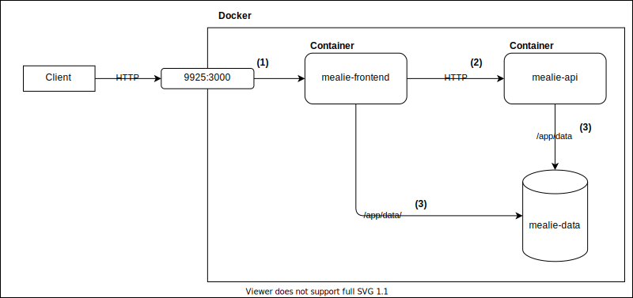

# Installation Checklist

To install Mealie on your server there are a few steps for proper configuration. Let's go through them.

!!! tip TLDR
    Don't need step by step? Checkout the

    - [SQLite docker-compose](./sqlite.md)
    - [Postgres docker-compose](./postgres.md)

## Pre-work

To deploy mealie on your local network it is highly recommended to use docker to deploy the image straight from dockerhub. Using the docker-compose templates provided, you should be able to get a stack up and running easily by changing a few default values and deploying. You can deploy with either SQLite (default) or Postgres. SQLite is sufficient for most use cases. Additionally, with Mealie's automated backup and restore functionality, you can easily move between SQLite and Postgres as you wish.

[Get Docker](https://docs.docker.com/get-docker/)

[Get Docker Compose](https://docs.docker.com/compose/install/)

[Mealie on Dockerhub](https://hub.docker.com/r/hkotel/mealie)

- linux/amd64
- linux/arm64


!!! warning "32bit Support"
    Due to a build dependency limitation, Mealie is not supported on 32bit ARM systems. If you're running into this limitation on a newer Raspberry Pi, please consider upgrading to a 64bit operating system on the Raspberry Pi.


## Step 1: Deployment Type
SQLite is a popular, open source, self-contained, zero-configuration database that is the ideal choice for Mealie when you have 1-20 Users and your concurrent write operations will be some-what limited. If you need to support many concurrent users, you may want to consider a more robust database such as PostgreSQL.

You can find the relevant ready to use docker-compose files for supported installations at the links below.

- [SQLite](./sqlite.md)
- [PostgreSQL](./postgres.md)

## Step 2: Setting up your files.

The following steps were tested on a Ubuntu 20.04 server, but should work for most other Linux distributions. These steps are not required, but is how I generally will setup services on my server.


1. SSH into your server and navigate to the home directory of the user you want to run Mealie as. If that is your current user, you can use `cd ~` to ensure you're in the right directory.
2. Create a directory called `docker` and navigate into it. `mkdir docker && cd docker`
3. Do the same for mealie `mkdir mealie && cd mealie`
4. Create a docker-compose.yaml file in the mealie directory. `touch docker-compose.yaml`
5. Use the text editor or your choice to edit the file and copy the contents of the docker-compose template for the deployment type you want to use. `nano docker-compose.yaml` or `vi docker-compose.yaml`


## Step 2: Customizing The `docker-compose.yaml` files.
After you've decided setup the files it's important to set a few ENV variables to ensure that you can use all the features of Mealie. I recommend that you verify and check that:

- [x] You've configured the relevant ENV variables for your database selection in the `docker-compose.yaml` files.
- [x] You've configured the [SMTP server settings](./backend-config.md#email) (used for invitations, password resets, etc)
- [x] Verified the port mapped on the `mealie-frontend` container is an open port on your server (Default: 9925)
- [x] You've set the [`BASE_URL`](./backend-config.md#general) variable.
- [x] You've set the `DEFAULT_EMAIL` and `DEFAULT_GROUP` variable.
- [x] Make any theme changes on the frontend container. [See Frontend Config](./frontend-config.md#themeing)

## Step 3: Startup
After you've configured your database, and updated the `docker-compose.yaml` files, you can start Mealie by running the following command in the directory where you've added your `docker-compose.yaml`.

```bash
$ docker-compose up -d
```

You should see the containers start up without error. You should now be able to access the Mealie frontend at [http://localhost:9925](http://locahost:9925).

!!! tip "Default Credentials"

    **Username:** changeme@email.com

    **Password:** MyPassword

## Step 4: Validate Installation

After the startup is complete you should see a login screen. Use the default credentials above to login and navigate to `/admin/site-settings`. Here you'll find a summary of your configuration details and their respective status. Before proceeding you should validate that the configuration is correct. For any warnings or errors the page will display an error and notify you of what you need to verify.

!!! tip "Docker Volume"
    Mealie uses a shared data-volume between the Backend and Frontend containers for images and assets. Ensure that this is configured correctly by using the "Docker Volume Test" section in the settings page. Running this validation will ensure that you have configured your volumes correctly. Mealie will not work correctly without this configured correctly.

## Step 5: Backup
While v1.0.0 is a great step to data-stability and security, it's not a backup. Mealie provides a full site data backup mechanism through the UI.

These backups are just plain .zip files that you can download from the UI or access via the mounted volume on your system. For complete data protection you MUST store these backups somewhere safe, and outside of the server where they are deployed.

## Appendix

### Docker Diagram

While the docker-compose file should work without modification, some users want to tailor it to their installation. This diagram shows network and volume architecture for the default setup. You can use this to help you customize your configuration.



In the diagram above there's a few crutial things to note.

1. Port 9925 is the host port, this can be anything you want. The important part is that it's mapped to the mealie-frontend container at port 3000.
2. The mealie-frontend container communicated with the mealie-api container through the INTERNAL docker network. This requires that the two containers are on the same network and that the network supports name resolution (anything but the default bridge network). The resolution URL can be specified in the docker-compose as the `API_URL` environment variable.
3. The mealie-data volume is mounted to BOTH the mealie-frontend and mealie-api containers. This is REQUIRED to ensure that images and assets are severed up correctly. While the default configuration is a docker-volume, that same can be accomplished by using a local directory mounted to the containers.
