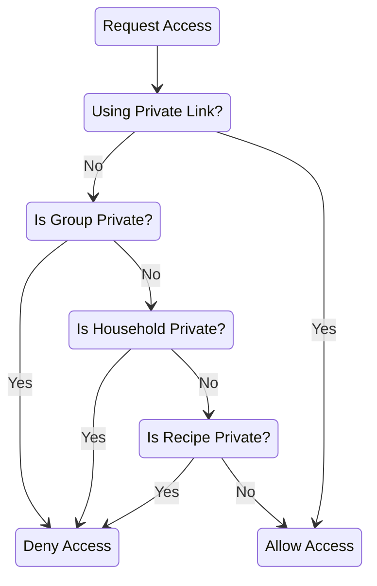

# Permissions and Public Access

Mealie provides various levels of user access and permissions. This includes:
- Authentication and registration ([LDAP](../authentication/ldap.md) and [OpenID Connect](../authentication/oidc.md) are both supported)
- Customizable user permissions
- Fine-tuned public access for non-users

## Customizable User Permissions

Each user can be configured to have varying levels of access. Some of these permissions include:
- Access to Administrator tools
- Access to inviting other users
- Access to manage their group and group data

Administrators can navigate to the Settings page and access the User Management page to configure these settings.

[User Management Demo](https://demo.mealie.io/admin/manage/users){ .md-button .md-button--primary }

## Public Recipe Access

By default, groups and households are set to private, meaning only logged-in users may access the group/household. In order for a recipe to be viewable by public (not logged-in) users, three criteria must be met:

1. The group must not be private
2. The household must not be private, *and* the household setting for allowing users outside of your group to see your recipes must be enabled. These can be toggled on the Household Settings page
2. The recipe must be set to public. This can be toggled for each recipe individually, or in bulk using the Recipe Data Management page

Additionally, if the group is not private, public users can view all public group data (public recipes, public cookbooks, etc.) from the home page ([e.g. the demo home page](https://demo.mealie.io/g/home)).

[Group Settings Demo](https://demo.mealie.io/group){ .md-button .md-button--primary }

More broadly, here are the rules for how recipe access is determined:

- Private links that are generated from the recipe page using the `Share` button bypass all group and recipe permissions
- Private groups block all access to recipes, including those that are public, except as noted above.
- Private households, similar to private groups, block all access to recipes, except as noted above.
- Households with "Allow users outside of your group to see your recipes" disabled block all access to recipes, except as noted above.
- Private recipes block all access to the recipe from public links. This does not affect Private Links.

