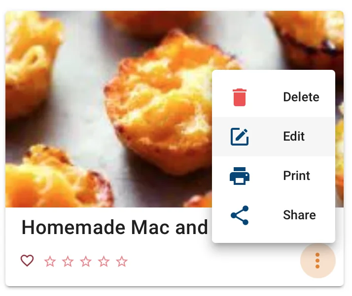

# Recipes

## URL Import
Adding a recipe can be as easy as clicking in the bottom-right corner, copying the recipe URL into Mealie and letting the web scraper organize information. Currently this scraper is implemented with [recipe-scrapers](https://github.com/hhursev/recipe-scrapers){:target="_blank"}. You may have mixed results on some websites, especially with blogs or non-specific recipe websites. See the bulk import Option below for another a convenient way to add blog style recipes into Mealie.

!!! tip
    You can find a list of some of the supported sites in the recipe-scrapers repo. If you're site isn't supported, you can work with the recipe-scrapers team to implement it and we can down-stream those changes into Mealie. 


## Using Bookmarklets

You can use bookmarklets to generate a bookmark that will take your current location, and open a new tab that will try to import that URL into Mealie.

You can use a [bookmarklet generator site](https://caiorss.github.io/bookmarklet-maker/){:target="_blank"} and the code below to generate a bookmark for your site. Just change the `http://localhost:8080` to your sites web address and follow the instructions. Note that there is no trailing `/`. 

```js
var url = document.URL ;
var mealie = "http://localhost:8080"
var dest = mealie + "/?recipe_import_url=" + url
window.open(dest, '_blank') 
```

## Recipe Editor

{: align=right style="height:225px;width:275px"}
Recipes can be edited and created via the UI. This is done with both a form based approach where you have a UI to work with as well as with a in browser JSON Editor. The JSON editor allows you to easily copy and paste data from other sources.

You can also add a custom recipe with the UI editor built into the web view. Using the `+` button on the site.

### Recipe Settings

Settings for a specific recipe can be adjusted in the settings menu inside the editor. Currently the settings supports

- Settings a Recipe to Public/Private
- Show Nutrition Values
- Show Assets
- Landscape Mode (Coming Soon)

!!! note
    Recipes set to private will only be displayed when a user is logged in. Currently there is no way to generate a share-link for a private recipe, but it is on the roadmap.

### Recipe Assets

While in the editor you also have an opportunity to upload any asset to your recipe. There are several icons that you can choose from or you can choose an arbitrary file icon. Once uploaded you can view or download the asset when viewing the page.

!!! tip
    You can get a link to an asset to embed in a recipe step by select the copy icon in editor mode. 

### Bulk Import

Mealie also supports bulk import of recipe instructions and ingredients. Select "Bulk Add" in the editor and paste in your plain text data to be parsed. Each line is treated as one entry and will be appended to the existing ingredients or instructions if they exist. Empty lines will be stripped from the text.


## Schema 
Recipes are stored in the json-like format in mongoDB and then sent and edited in json format on the frontend. Each recipes uses [Recipe Schema](https://schema.org/Recipe){:target="_blank"} as a general guide with some additional properties specific to Mealie.

### Example
```json
{
  "id": 263,
  "name": "Homemade Mac and Cheese Bites",
  "slug": "homemade-mac-and-cheese-bites",
  "image": "no image",
  "description": "These are so simple and the perfect finger food ideal for serving kids and as an appetizer! These are DELICIOUS",
  "recipeCategory": [],
  "tags": [],
  "rating": null,
  "dateAdded": "2021-06-07",
  "dateUpdated": "2021-06-07T16:23:10.254840",
  "recipeYield": null,
  "recipeIngredient": [
    "½ pound elbow macaroni",
    "2 Tablespoons butter",
    "2 Tablespoons flour",
    "1½ cups milk",
    "2 cups shredded sharp cheddar cheese",
    "2 ounces cream cheese",
    "½ teaspoon salt",
    "¼ teaspoon pepper",
    "1 egg beaten"
  ],
  "recipeInstructions": [
    {
      "title": "Preperation",
      "text": "Preheat oven to 400 degrees F."
    },
    {
      "title": "",
      "text": "Spray mini muffin tins with cooking spray."
    },
    {
      "title": "",
      "text": "Cook pasta according to packaged directions and set aside."
    },
    {
      "title": "Cooking",
      "text": "In a medium size pan combine butter and flour over medium heat. Whisk until butter is melted and mixture is smooth. Slowly add milk and bring to a simmer. Add 1½ cups of the cheese, cream cheese, salt and pepper. Stir until smooth and creamy. Remove from heat."
    },
    {
      "title": "",
      "text": "In a large mixing bowl, carefully stir pasta, cheese sauce, and egg until evenly mixed and pasta is evenly coated."
    },
    {
      "title": "",
      "text": "Spoon mac and cheese into mini muffin tins and top each with a small pinch of remaining cheese. Bake at 400 degrees F for 15 minutes or until golden brown."
    },
    {
      "title": "",
      "text": "Allow to cool 5 minutes before gently removing the bites."
    }
  ],
  "nutrition": {
    "calories": null,
    "fatContent": null,
    "proteinContent": null,
    "carbohydrateContent": null,
    "fiberContent": null,
    "sodiumContent": null,
    "sugarContent": null
  },
  "tools": [],
  "totalTime": null,
  "prepTime": null,
  "performTime": null,
  "settings": {
    "public": true,
    "showNutrition": true,
    "showAssets": true,
    "landscapeView": true
  },
  "assets": [],
  "notes": [],
  "orgURL": "https://www.chef-in-training.com/homemade-mac-and-cheese-bites/",
  "extras": {},
  "comments": []
}
```
