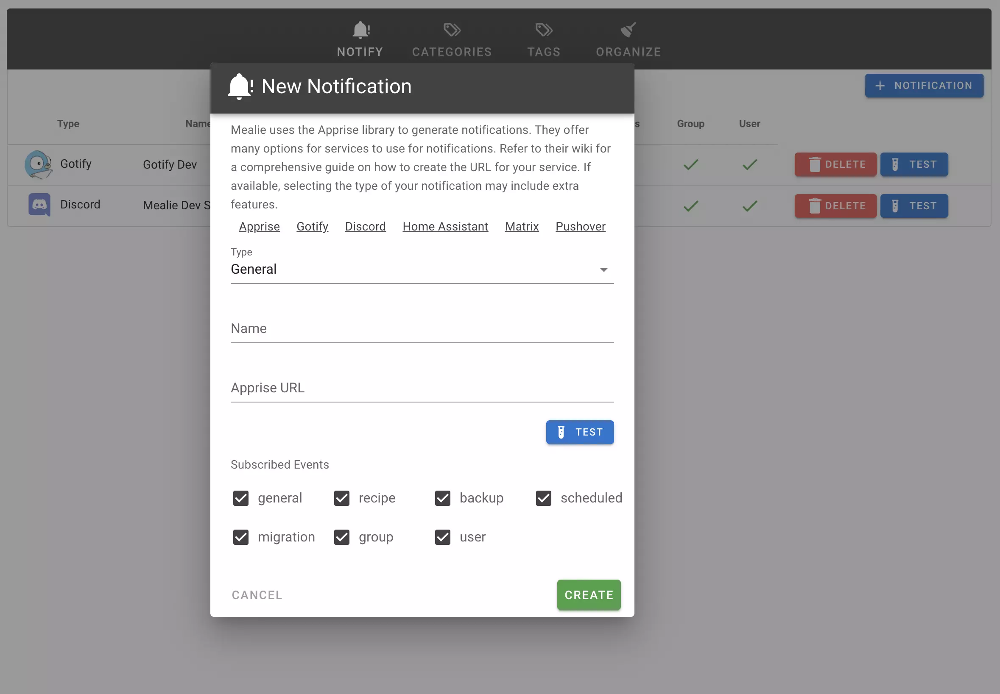
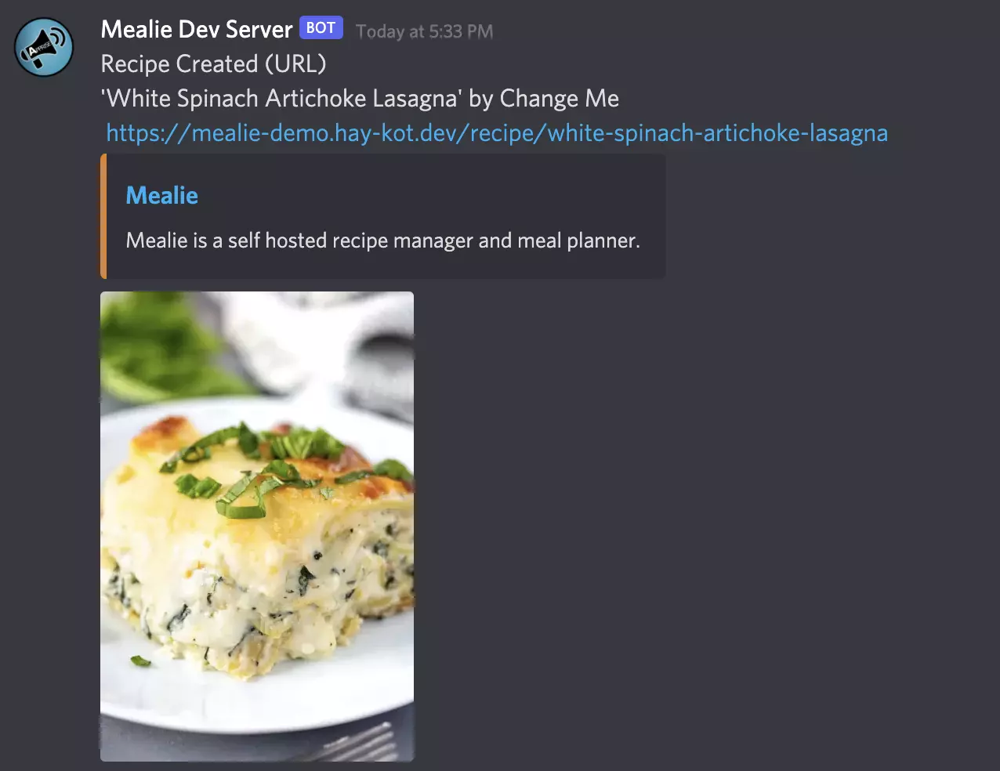
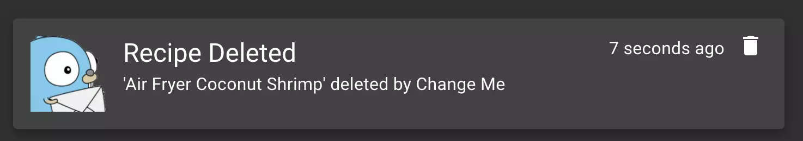

# External Notifications

## Apprise

Using the [Apprise](https://github.com/caronc/apprise/){:target="_blank"} library Mealie is able to provide notification services for nearly every popular service. Some of our favorites are...

- [Gotify](https://github.com/caronc/apprise/wiki/Notify_gotify){:target="_blank"}
- [Discord](https://github.com/caronc/apprise/wiki/Notify_discord){:target="_blank"}
- [Home Assistant](https://github.com/caronc/apprise/wiki/Notify_homeassistant){:target="_blank"}
- [Matrix](https://github.com/caronc/apprise/wiki/Notify_matrix){:target="_blank"}
- [Pushover](https://github.com/caronc/apprise/wiki/Notify_pushover){:target="_blank"}

But there are many more to choose from! Take a look at their wiki for information on how to create their URL formats that you can use to create a notification integration in Mealie.

## Subscribe Events
There are several categories of events that mealie logs that can be broadcast with the notifications feature. You can also see a feed of your events in the Admin Dashboard

- General Events
    - Application Startup
- Recipe Events
    - Create Recipe
    - Delete Recipe
- Database Events
    - Export/Import
    - Database Initialization
- Scheduled Events
    - MealPlan Webhooks Sent
- Group Events
    - Create/Delete Groups
- User Events
    - User Creation
    - User Sign-up
    - Sign-up Token Creation
    - Invalid login attempts

In most cases the events will also provide details on which user performed the action. Now you'll know when your grandma deletes your favorite recipe!

!!! info
    This is a new feature and we are still working through all the possibilities of events. if you have an idea for an event let us know!

## Creating a New Notification

New events can be created and viewed in admin Toolbox `/admin/toolbox?tab=event-notifications`. Select the "+ Notification" button and you'll be provided with a dialog. Complete the form using the URL for the service you'd like to connect to. Before saving be sure to use the test feature.

!!! tip
    The feedback provided from the test feature indicates only if the URL you provided is valid, not if the message was successfully sent. Be sure to check the notification feed for the test message.

### Examples

#### Discord

#### Gotify

