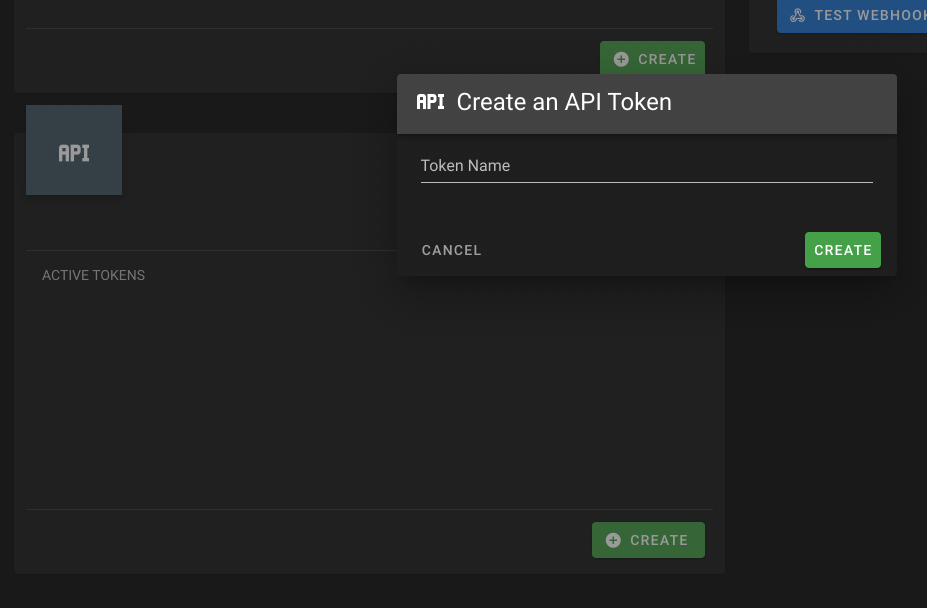

# User Settings

## Profile Settings
In the users profile they are able to:

- Change Display Name
- Change Email
- Update Password
- View Their Group
- Update Profile Picture (Experimental)
- Create API Keys

## Themes
Color themes can be created and set from the UI in the Settings-Profile page. You can select an existing color theme or create a new one. On creation of a new color theme, the default colors will be used, then you can select and save as you'd like. By default, the "default" theme will be loaded for all new users visiting the site. All created color themes are available to all users of the site. Theme Colors will be set for both light and dark modes.

!!! tip
    Theme data is stored in local storage in the browser. Calling "Save colors and apply theme will refresh the local storage with the selected theme as well save the theme to the database. 

## Group & Meal Plan
In the meal planner section a user can select categories to be used as a part of the random recipe selector in the meal plan creator. If no categories are selected, all recipes will be used

Meal planner webhooks are post requests sent from Mealie to an external endpoint. The body of the message is the Recipe JSON of the scheduled meal. If no meal is schedule, no request is sent. The webhook functionality can be enabled or disabled as well as scheduled. Note that you must "Save" prior to any changes taking affect server side. 

## API Key Generation
Users can quickly and easily generate API keys with the user interface. Provide a name for your token and then you are shown 1 time the generated API key. If you ever loose the API key you are not able to identify or retrieve it from the UI. 

!!! warning
    API keys are stored in plain text in the database.