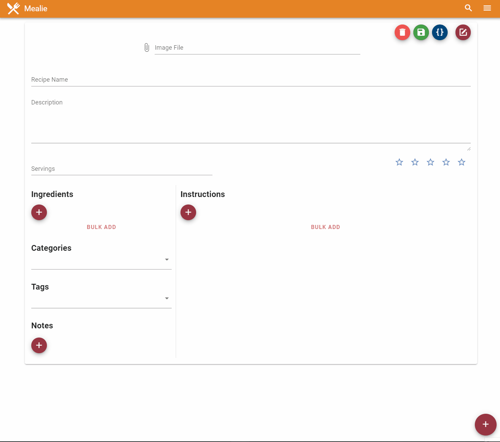

# Recipes

## URL Import
Adding a recipe can be as easy as copying the recipe URL into mealie and letting the web scrapper try to pull down the information. Currently this scraper is implemented with [scrape-schema-recipe package](https://pypi.org/project/scrape-schema-recipe/). You may have mixed results on some websites, especially with blogs or non specific recipe websites. See the bulk import Option below for another a convenient way to add blog style recipes into Mealie.


## Recipe Editor
Recipes can be edited and created via the UI. This is done with both a form based approach where you have a UI to work with as well as with a in browser JSON Editor. The JSON editor allows you to easily copy and paste data from other sources. 

You can also add a custom recipe with the UI editor built into the web view.

## Bulk Import
Mealie also supports bulk import of recipe instructions and ingredients. Select "Bulk Add" in the editor and paste in your plain text data to be parsed. Each line is treated as one entry and will be appended to the existing ingredients or instructions if they exist. Empty lines will be stripped from the text.



## Schema 
Recipes are stored in the json-like format in mongoDB and then sent and edited in json format on the frontend. Each recipes uses [Recipe Schema](https://schema.org/Recipe) as a general guide with some additional properties specific to Mealie.

### Example
```json
{
    _id: ObjectId('5fcdc3d715f131e8b191f642'),
    name: 'Oat and Pecan Brittle Cookies',
    description: 'A gorgeously textured cookie with crispy-edges, a chewy center, toasty pecans, and tiny crispy pecan brittle bits throughout.',
    image: 'oat-and-pecan-brittle-cookies.jpg',
    recipeYield: 'Makes about 18',
    recipeIngredient: [
        '1¼ cups (142 g) coarsely chopped pecans',
        '¾ cup (150 g) granulated sugar',
        '4 Tbsp. (½ stick) unsalted butter',
        '½ tsp. baking soda',
        '½ tsp. Diamond Crystal or ¼ tsp. Morton kosher salt',
        '1 cup (2 sticks) unsalted butter, cut into 16 pieces, divided',
        '1⅓ cups (173 g) all-purpose flour',
        '2 tsp. Diamond Crystal or 1 tsp. Morton kosher salt',
        '1 tsp. baking soda',
        '2 cups (200 g) old-fashioned oats, divided',
        '¾ cup (packed; 150 g) dark brown sugar',
        '½ cup (100 g) granulated sugar',
        '2 large eggs',
        '1 Tbsp. vanilla extract'
    ],
    recipeInstructions: [
        {
            '@type': 'HowToStep',
            text: 'Place a rack in middle of oven; preheat to 350°. Toast pecans on a small rimmed baking sheet, tossing halfway through, until slightly darkened and fragrant, 8–10 minutes. Let cool.'
        },
        {
            '@type': 'HowToStep',
            text: 'Line another small rimmed baking sheet with a Silpat baking mat. Cook granulated sugar, butter, and 2 Tbsp. water in a small saucepan over medium-low heat, stirring gently with a heatproof rubber spatula, until sugar is dissolved. Increase heat to medium and bring syrup to a rapid simmer. Cook, without stirring, swirling pan often, until syrup turns a deep amber color, 8–10 minutes. Immediately remove saucepan from heat and stir in pecans. Once pecans are well coated, add baking soda and salt and stir to incorporate (mixture will foam and sputter as baking soda aerates caramel). Working quickly (it will harden fast), scrape mixture onto prepared baking sheet and spread into a thin layer. Let cool completely, 5–10 minutes. Chop into pea-size pieces; set aside.'
        },
        {
            '@type': 'HowToStep',
            text: 'Place half of butter (½ cup) in the bowl of a stand mixer. Bring remaining butter to a boil in a small saucepan over medium-low heat, stirring often with a heatproof rubber spatula. Cook, scraping bottom and sides of pan constantly, until butter sputters, foams, and, eventually, you see browned bits floating on the surface, 5–7 minutes. Pour brown butter over butter in stand mixer bowl, making sure to scrape in all the browned bits. Let sit until butter begins to resolidify, about 30 minutes.'
        },
        {
            '@type': 'HowToStep',
            text: 'Pulse flour, salt, and baking soda in a food processor to combine. Add half of reserved pecan brittle and 1 cup oats; process in long pulses until oats and brittle are finely ground.'
        },
        {
            '@type': 'HowToStep',
            text: 'Add brown sugar and granulated sugar to butter and beat with paddle attachment on medium speed until light and smooth but not fluffy, about 2 minutes. Scrape down sides of bowl and add eggs and vanilla. Beat until very light and satiny, about 1 minute. Scrape down sides of bowl and add flour mixture; beat on low speed until no dry spots remain and you have a soft, evenly mixed dough. Add remaining half of brittle and remaining 1 cup oats; mix on low speed just to distribute. Fold batter several times with a spatula to ensure everything is evenly mixed.'
        },
        {
            '@type': 'HowToStep',
            text: 'Using a 2-oz. scoop or ¼-cup measuring cup, scoop level portions of dough to make 18 cookies. Place on a parchment-lined baking sheet, spacing as close together as possible (you’ll space them out before baking). Cover tightly with plastic wrap and chill at least 12 hours and up to 2 days. (If you’re pressed for time, a couple hours will do; cookies just won’t be as chewy.)'
        },
        {
            '@type': 'HowToStep',
            text: 'When ready to bake, place racks in upper and lower thirds of oven; preheat to 350°. Line 2 large rimmed baking sheets with parchment paper. Arrange 6 cookies on each prepared baking sheet, spacing at least 3" apart.'
        },
        {
            '@type': 'HowToStep',
            text: 'Bake cookies, rotating baking sheets top to bottom and front to back after 12 minutes, until dark golden brown around the edges, 16–20 minutes. Let cookies cool 5 minutes on baking sheets, then transfer cookies to a wire rack with a spatula and let cool completely.'
        },
        {
            '@type': 'HowToStep',
            text: 'Carefully move a rack to middle of oven. Arrange remaining dough on one of the baking sheets (it’s okay if it’s still warm). Bake as before (this batch might go a bit faster).\nDo ahead: Dough can be formed 2 months ahead; chill dough balls at least 2 hours before transferring to freezer. Once frozen solid, store in resealable plastic freezer bags and keep frozen. No need to thaw before baking, but you may need to add a minute or two to the baking time. Cookies can be baked 5 days ahead; store airtight at room temperature.'
        }
    ],
    slug: 'oat-and-pecan-brittle-cookies',
    tags: [],
    categories: [],
    dateAdded: ISODate('2020-12-07T05:55:35.434Z'),
    notes: [],
    orgURL: 'https://www.bonappetit.com/recipe/oat-and-pecan-brittle-cookies',
    rating: 3
}
```
