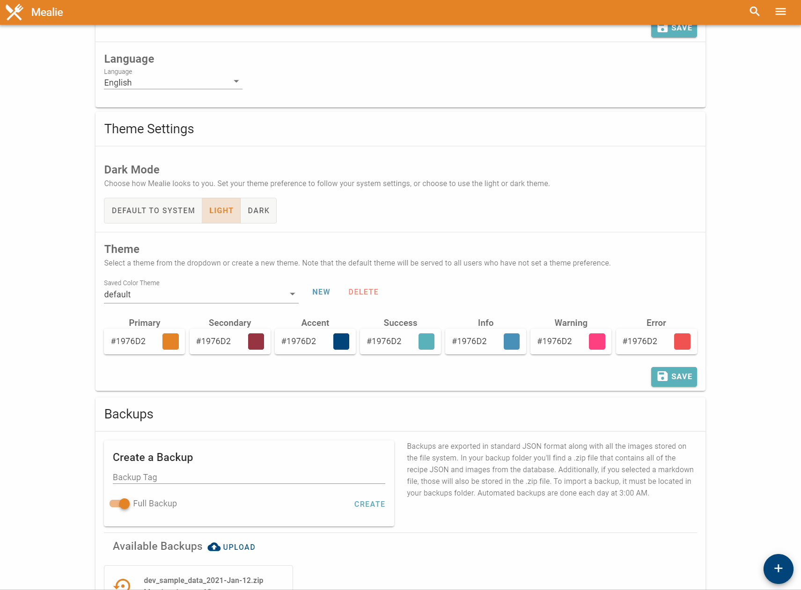

# Site Settings Panel
!!! danger
    As this is still a **BETA** It is recommended that you backup your data often and store in more than one place. Ad-hear to backup best practices with the [3-2-1 Backup Rule](https://en.wikipedia.org/wiki/Backup)

## General Settings
In your site settings page you can select several options to change the layout of your homepage. You can choose to display the recent recipes, how many cards to show for each section, and which category sections to display. You can additionally select which language to use by default. Note the currently homepage settings are saved in your browser. In the future a database entry will be made for site settings so the homepage is consistent across users.

## Theme Settings
Color themes can be created and set from the UI in the settings page. You can select an existing color theme or create a new one. On creation of a new color theme, the default colors will be used, then you can select and save as you'd like. By default the "default" theme will be loaded for all new users visiting the site. All created color themes are available to all users of the site. Theme Colors will be set for both light and dark modes.

!!! note
    Theme data is stored in localstorage in the browser. Calling "Save colors and apply theme will refresh the local storage with the selected theme as well save the theme to the database. 

## Backups 
Site backups can easily be taken and download from the UI. To import, simply select the backup you'd like to restore and check which items you'd like to import. 

## Meal Planner 
In the meal planner section you can select categories to be used as apart of the random recipe selector in the meal plan creator. 

Meal planner webhooks are post requests sent from Mealie to an external endpoint. The body of the message is the Recipe JSON of the scheduled meal. If no meal is schedule, no request is sent. The webhook functionality can be enabled or disabled as well as scheduled. Note that you must "Save Webhooks" prior to any changes taking affect server side. 

