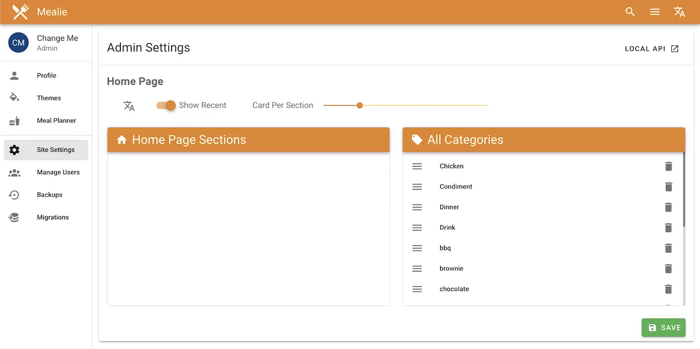

# Site Settings 
Your sites settings panel can only be accessed by administrators. This where you can customize your site for all users. 

## Home Page Settings
| Option             | Description                                                    |
| ------------------ | -------------------------------------------------------------- |
| Language           | The default site language                                      |
| Show Recent        | To display the recent recipes section on the home page         |
| Card Per Section   | The amount of cards displayed in each section on the home page |
| Home Page Sections | Category sections to include on the home page                  |

